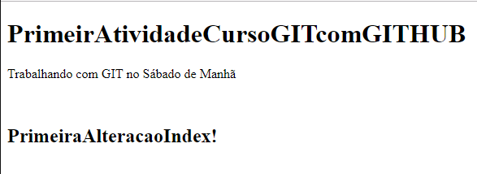

# PrimeirAtividadeCursoGITcomGITHUB
Atividade Realizada UNIFACS Curso GIT With GITHUB
-   Desenvolvedor: VigoMarcelo
-   PrimeiroProjetoGIT

### Description:
> Página simples em html. GIT With GITHUB

Tecnologias utilizadas
* HTML
* [GIT](https://github.com/)
* MarkDown

### Comandos aprendidos:
```sh
$ git config --global user.nome "su nombre"
```
Após a criação da pasta do projeto no computador
```sh
$ cd Desktop/primeiro-projeto-github
$ git init
$ git status
$ git add
$ git commit
```
### Imagem da Página


[](https://travis-ci.org/joemccann/dillinger)

[](https:www)
